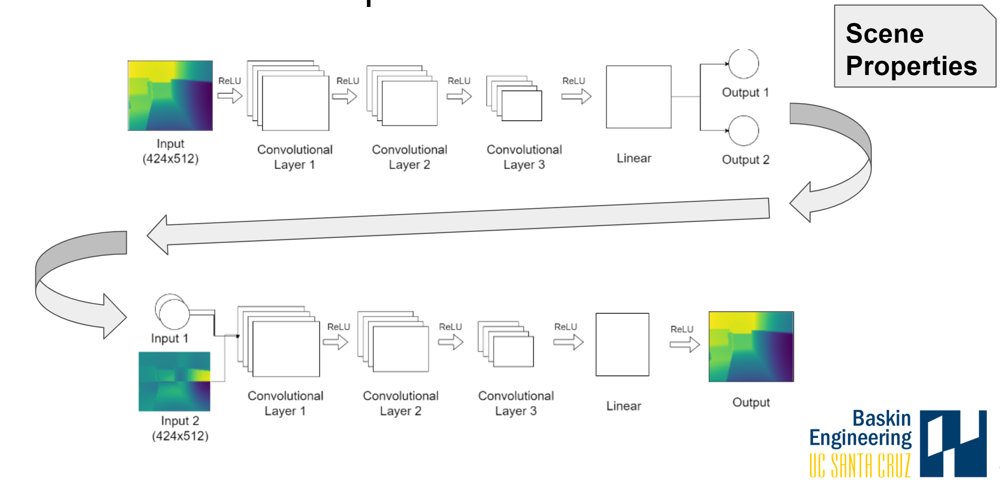
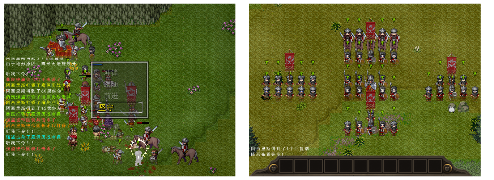
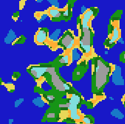
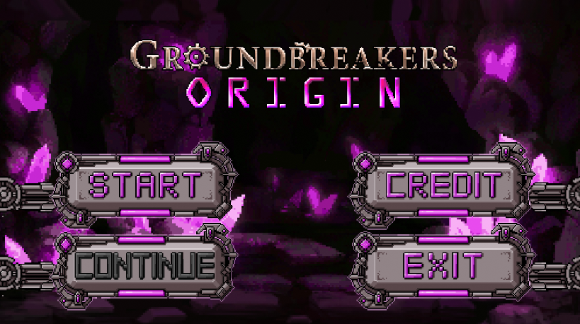
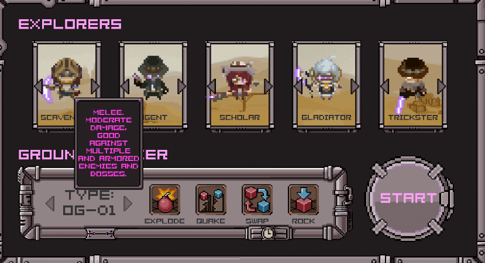
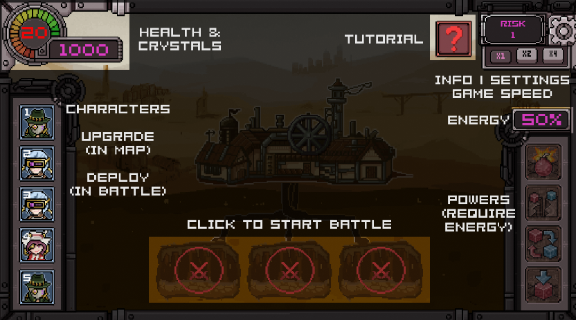
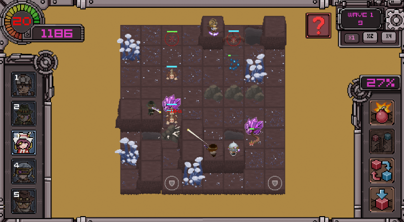

## Research Experiences

### Interactive Generative 3D Shapes(#3d-shapes)
[[Paper]](img/3d-shapes/paper_final.pdf) [[Slides]](img/3d-shapes/presentation.pdf) [[Code]](https://github.com/xuyanwen2012/interactive_generative_3d_shapes)

### [Denoising Multipath Interference in Time-of-Flight Imaging](#3d-tof)
[[Paper]](img/3d-tof/Denoising_3D_Time_Of_Flight_Data.pdf) [[Code]](https://github.com/daemonslayer/3d-tof-denoising)

### [Closing Prediction Markets without Ground Truth](#prediction-markets)
[[Report]](img/prediction-market/CSE_290T_Final_Report__Project_Title.pdf)

---

## Games

### [Real-time ARPG Battle System](#mbbs)
[[Video]](https://www.youtube.com/watch?v=ddu1r0sn4vo) [[Code]](https://github.com/xuyanwen2012/RMMV-Battle-System-JS)

### [Legendary Warband]
[[Video]](https://www.youtube.com/watch?v=2VEd8NKbcb4&t=11s) [[Code]](https://github.com/xuyanwen2012/XP-MBBS-7.0)

### [Alterrain](#alterrain)
[[Code]](https://github.com/IDANIO/Alterrain)

### [Groundbreakers Origin](#groundbreakers)
[[Code]](https://github.com/Groundbreakers/Groundbreakers)

---

## Other Projects

### [Course Graph](#course-graph)

---

## Misc

### 🎺ToyTracer

[[Code]](https://github.com/xuyanwen2012/ToyTracer)

