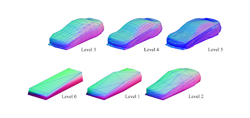

## Research Experiences

### Interactive Generative 3D Shapes(#3d-shapes)
[[Paper]](img/3d-shapes/paper_final.pdf) [[Slides]](img/3d-shapes/presentation.pdf) [[Code]](https://github.com/xuyanwen2012/interactive_generative_3d_shapes)

### [Denoising Multipath Interference in Time-of-Flight Imaging](#3d-tof)

### [Closing Prediction Markets without Ground Truth](#prediction-markets)

## Games

### [Real-time ARPG Battle System](#mbbs)

### [Alterrain](#alterrain)

### [Groundbreakers Origin](#groundbreakers)

## Other Projects

### [Course Graph](#course-graph)

### []

### 

## Misc

