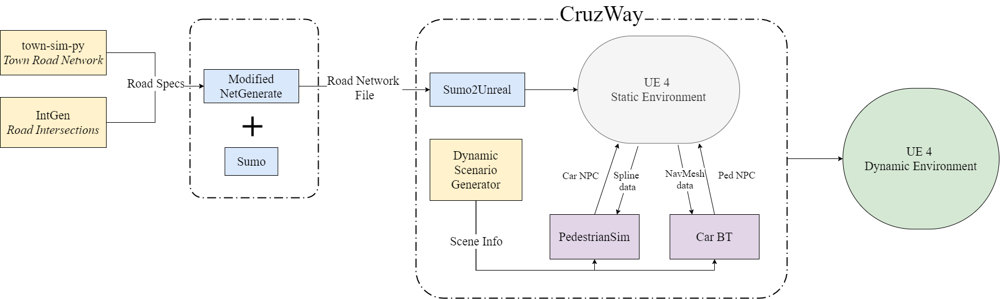
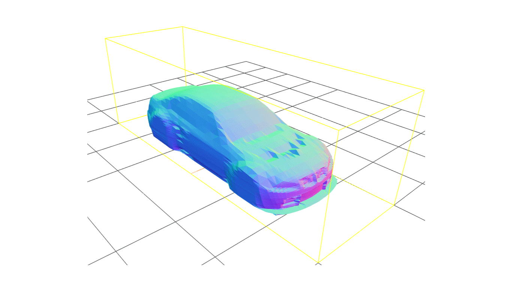
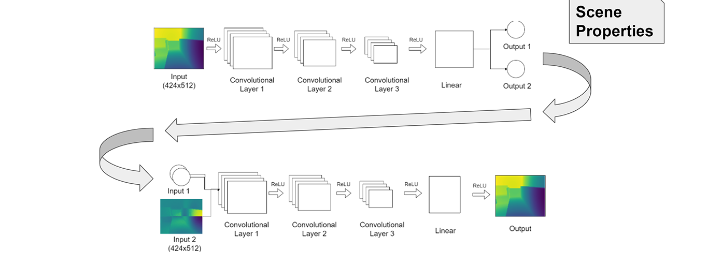
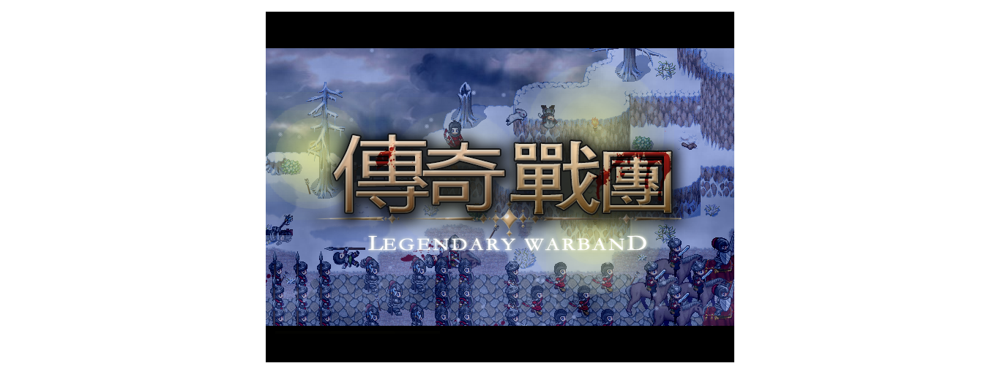
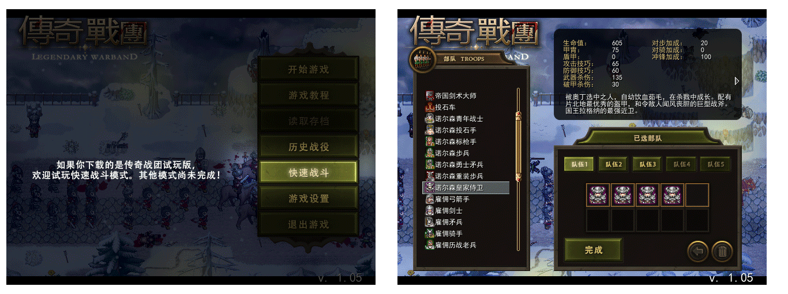
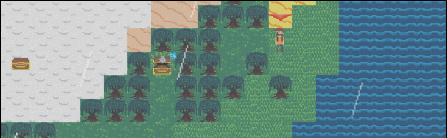
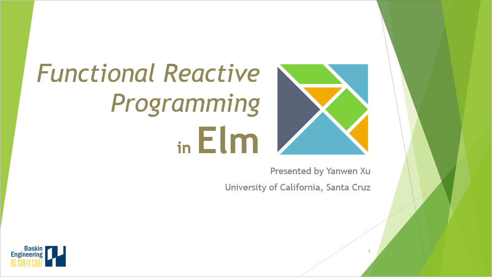
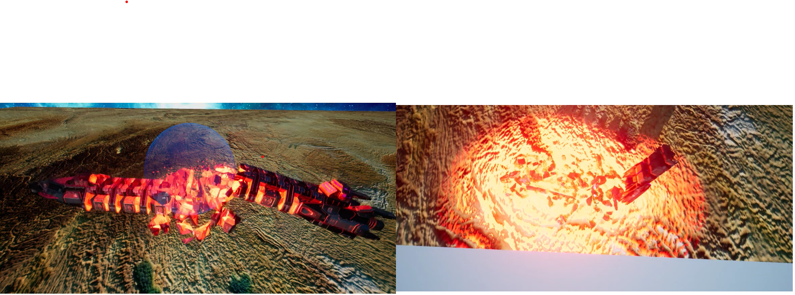
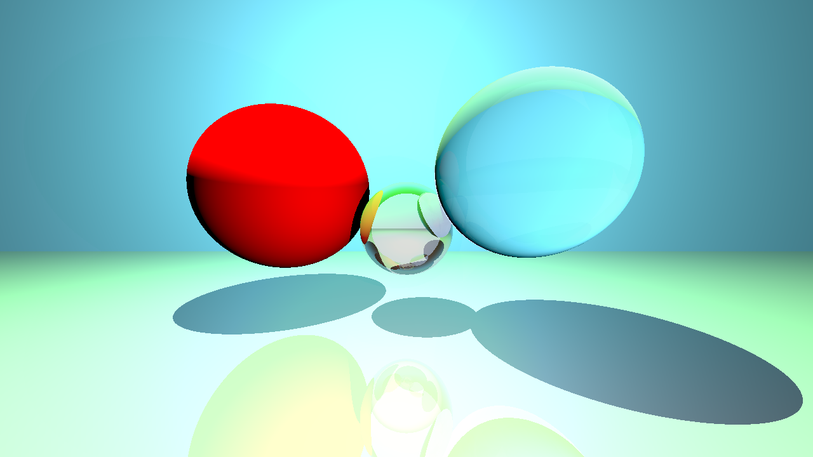
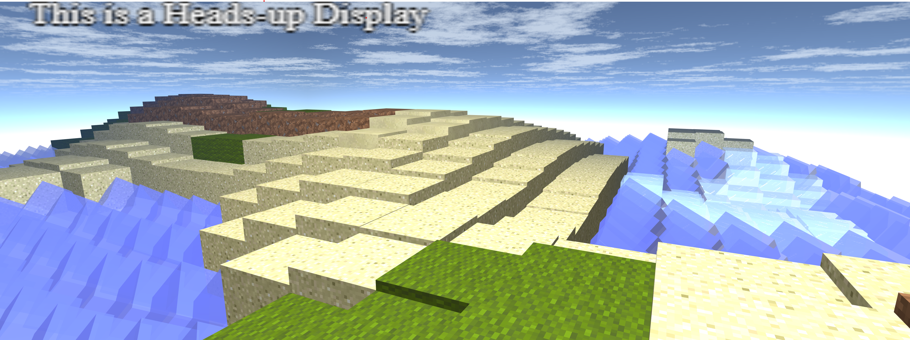

## Current Researches

### Pedestrian Behavior Simulation in Unreal Engine 4 

> Currently studying Behavior Tree models to simulate pedestrian's behaviors in autonomous vehicles testing scenarios. Actively developing Unreal Plugins for [Augmented Design Lab](https://games.soe.ucsc.edu/adl) at UCSC. 

[[PedestrianSim]](https://github.com/xuyanwen2012/PedestrianSim) [[Sumo2Unreal]](https://github.com/AugmentedDesignLab/Sumo2Unreal) 

:clap::clap::clap: **(3/14/2020) Paper Submitted** to 2020 IEEE Intelligent Vehicles Symposium (IV) (IV 2020). 

* Authors: Ishaan Paranjape, Abdul Jawad, **Yanwen Xu**, Asiiah Song, Jim Whitehead

* Title: *A Modular Architecture for Procedural Generation of Towns, Intersections and Scenarios for Testing Autonomous Vehicles*

---

## Research Experiences

### Interactive Generative 3D Shapes
[[Paper]](img/3d-shapes/paper_final.pdf) [[Slides]](img/3d-shapes/presentation.pdf) [[Code]](https://github.com/xuyanwen2012/interactive_generative_3d_shapes)

> Implemented a shrink-wrap algorithmn from SIGGRAPH that can normalizes similarly shaped 3D meshes for machine learning applications. The parameterization algorithm construct height map regardless of the mesh’s irregular format. We leveraged the power of an autoencoder to explore the latent space behind the 3D shapes in the same category.

### Denoising Multipath Interference in Time-of-Flight Imaging
[[Paper]](img/3d-tof/Denoising_3D_Time_Of_Flight_Data.pdf) [[Code]](https://github.com/daemonslayer/3d-tof-denoising)

> We propose a novel method for MPI noise removal usinga two-part convolutional neural network. The first model learns aboutthe core properties of the reflective objects in the scene, such as the re-flectively of the scene and local ambient light density. The second modellearns to map such properties along with a False Depth Map to create a True Depth Map of the scene. We demonstrate and validate our resultson synthetic dataset.

---

## Games

### Real-time ARPG Battle System
[[YouTube Video]](https://www.youtube.com/watch?v=ddu1r0sn4vo) [[Code]](https://github.com/xuyanwen2012/RMMV-Battle-System-JS)

> A highly-reputed Combat system written in JavaScript for RPG Maker MV, recieved overwhelmed positive feedbacks from the Community. The combat systems has altered the turn-based J-RPG combat system in traditional RPG Maker Game to real-time Action RPG.   

<!--  -->

### Legendary Warband
[[YouTube Video]](https://www.youtube.com/watch?v=2VEd8NKbcb4&t=11s) [[Code]](https://github.com/xuyanwen2012/XP-MBBS-7.0)

> Award winning game series, Legendary Warband is a novel Action Rule-palying game made with RPG Maker Engine. In the game, player can lead and combat hundreds of units in real time. The system is programmed in Ruby, and I created my own pixel art assets.  

### Alterrain
[[Code]](https://github.com/IDANIO/Alterrain)

> An HTML5 Online Multiplayer exploration games, implemented with Node.js and WebSocket. The first Online Multiplayer game project made at UCSC for game design projects. Procedually generated terrain. 

  

<!--  -->

### Groundbreakers Origin
[[Code]](https://github.com/Groundbreakers/Groundbreakers)

> My undergraduate Capstone Project for my Game Design major. A rogue-like tower-defense RPG game with novel terrain-alteration mechanics. Developed in Unity with C#. Moreover, I developed editor plugins using OdinInspector to help our designers to create enemy easier.    

---

## Other Projects

### 🌳 Featherweight Elm Interpreter in Rust
[[Code]](https://github.com/xuyanwen2012/elm-rust)

> An experimental lightweight interpreter for [Elm](https://elm-lang.org/) written in Rust. The project is inspired by the featherweight Elm language described in the original [Elm paper](https://elm-lang.org/assets/papers/concurrent-frp.pdf) by Evan Czaplicki. 

### Exploring Chaos Destruction with Niagara Particle System in Unreal Engine 4
[[Report]](img/chaos/Exploring_Chaos_Destruction_with_Niagara_Particle_System_in_Unreal_Engine_4.pdf) [[Video]](https://www.youtube.com/watch?time_continue=1&v=WnivTQNzUEw&feature=emb_logo)[[Code]](https://github.com/xuyanwen2012/ChaosProject) [[Official Epic Blog post (On the way...)]]

> In this work, we explored the Chaos physics System in traditional game development workflow in Unreal Engine. We created a space-setting scene that demonstratedthe aesthetic and robustness of massive destruction using Chaos. 

### Course Graph
[[Code]](https://github.com/coursegraph/CourseGraph)

> Course Graph is a lightning-fast web application to search for your UCSC/UCSD courses. Course Graph is built with Server Side Rendering Technology, as well as React, Node.js and MongoDB.

  

---

## Misc

### 🎺ToyTracer
[[Code]](https://github.com/xuyanwen2012/ToyTracer)

> A naive toy Ray Tracer built from scract for the Game Engine class in Modern C++ 11. Including Phong Lighting, Relection & Refraction, Fresnel Effect, and Gamma Correction.  

### WebGL Minecraft
[[Demo]](https://people.ucsc.edu/~yxu83/asg7/)

> A Simple WebGL implementation of an Interactive Minecraft Editor. Including Blinn-Phong, HUD, FOG, Alpha Blending, Collision Detection, Skybox, and Terrain generation. 

